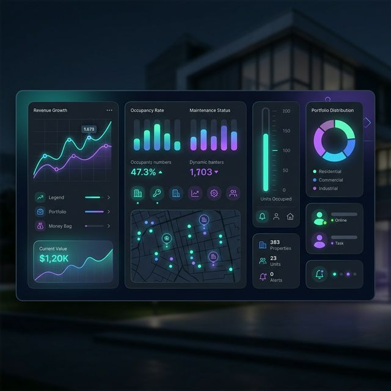

<div align="center">
  

  # 🏠 Property Management Dashboard

  **Modern, Intelligent, and Sleek Property Management System**

  [](https://laravel.com)
  [](https://vuejs.org)
  [](https://tailwindcss.com)
  [](https://inertiajs.com)
  [](https://typescriptlang.org)

  <p align="center">
    A state-of-the-art property management solution built with efficiency and user experience in mind. 
    Manage properties, tenants, and finances with precision and ease.
  </p>

  [Features](#-key-features) • [Tech Stack](#-tech-stack) • [Setup](#-installation--setup) • [AI Insights](#-ai--intelligence)
</div>

---

## 🚀 Key Features

### 🏢 Property & Unit Management
Full-cycle management of your real estate portfolio. Track properties, locations, and individual units/rooms with a clean, responsive interface.

### 👥 Tenant & Lease Tracking
Stay on top of your tenant relationships. Manage leases, track start and end dates, and monitor tenant status in real-time.

### 💰 Financial Management
Comprehensive tracking of **Receipts** and **Expenses**. Maintain accurate financial records for each property and unit to ensure profitability.

### 🤖 AI-Powered Intelligence
- **Semantic Search**: Find information naturally across your entire database.
- **AI Insights**: Generate data-driven insights and reports to optimize your property management strategy.

### 🔒 Secure by Default
Built on **Laravel Fortify**, providing robust authentication, registration, and session management.

---

## 🛠 Tech Stack

| Category | Technology |
| :--- | :--- |
| **Backend** | **Laravel 12**, PHP 8.2+ |
| **Frontend** | **Vue.js 3** (Composition API) |
| **Styling** | **Tailwind CSS 4**, Shadcn-Vue |
| **Communication** | **Inertia.js**, Axios |
| **Architecture** | **TypeScript**, MVC, Repository Pattern |
| **Auth** | **Laravel Fortify** |

---

## ⚙️ Installation & Setup

Get your project up and running in minutes.

### 1. Clone & Install
```bash
git clone <your-repo-ui>
cd property
composer install
npm install
```

### 2. Configure Environment
```bash
cp .env.example .env
php artisan key:generate
```

### 3. Database Migration
```bash
# Ensure your .env has correct database credentials
php artisan migrate --seed
```

### 4. Run Development Server
```bash
# Runs both Laravel and Vite concurrently
npm run dev
```

---

## 📂 Project Structure

```text
├── app/                  # Laravel Core (Models, Controllers, Services)
├── database/            # Migrations, Seeders, Factories
├── resources/js/        # Vue.js Components & Pages
│   ├── Components/      # Shared Components (Shadcn UI)
│   ├── Pages/           # Inertia Page Components
│   └── Layouts/         # Application Layouts
├── routes/              # Web, API, and Settings routes
├── config/              # Application Configuration
└── public/              # Static Assets (Images, Banner)
```

---

## ✨ AI & Intelligence

This application leverages modern AI patterns to enhance the management experience:

- **Semantic Search**: Uses vector-like logic to find properties and tenants based on context, not just keywords.
- **Instant Insights**: One-click generation of performance metrics and property health reports.

---

## 🎨 UI/UX Design

The project uses a premium design system powered by **Shadcn-Vue** and **Tailwind CSS**. 
- **Dark Mode Support**: Deep, modern aesthetic for prolonged usage.
- **Glassmorphism**: Subtle translucency and depth across the interface.
- **Micro-animations**: Smooth transitions and hover effects for a premium feel.

---

<div align="center">
  <p>Built with ❤️ for modern property managers.</p>
  <p>© 2026 Herd Property. All rights reserved.</p>
</div>
